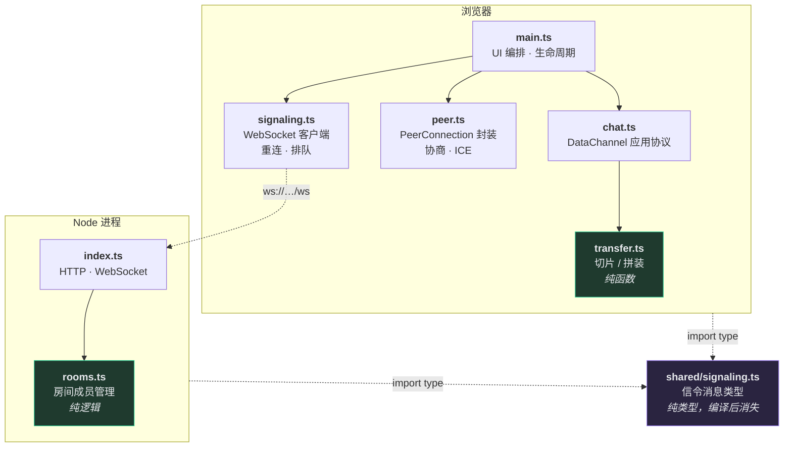
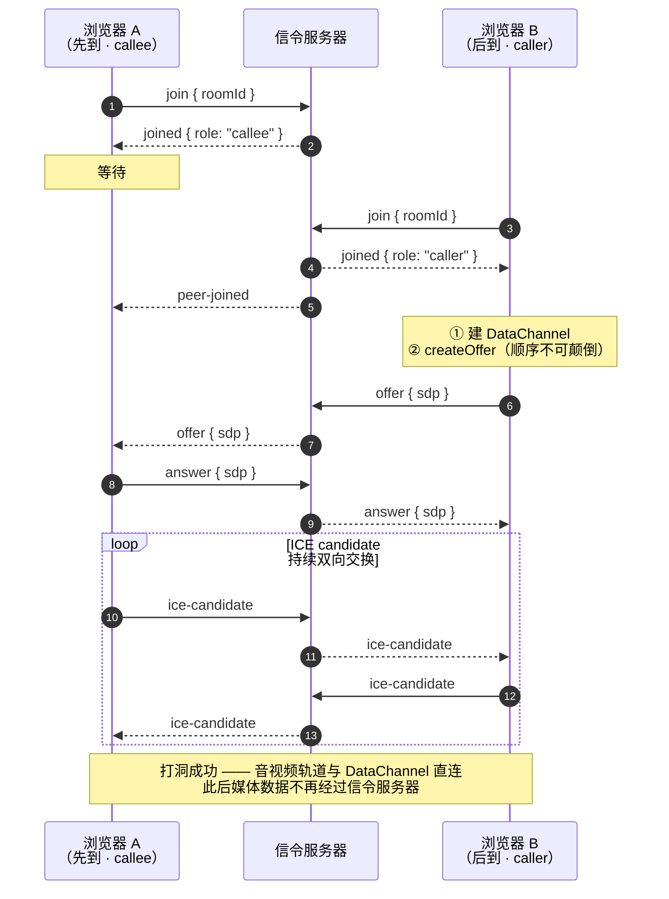
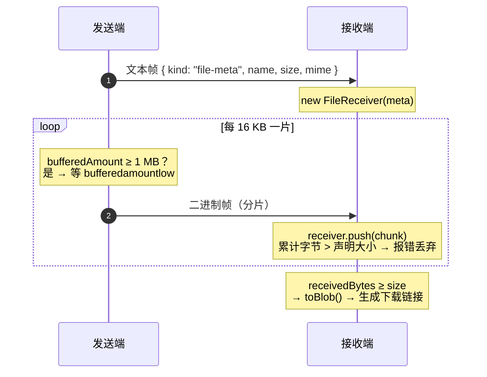

# WebRTC Demo 设计文档

---

## 一、需求

### 背景

需要一个 WebRTC 演示项目，用来完整展示浏览器之间建立点对点实时通信的全过程 —— 包括规范留白、必须自己实现的信令部分。

### 功能需求

| 编号 | 功能 | 说明 |
| --- | --- | --- |
| F1 | 房间加入 | 两人填写同一房间号即可配对，房间号可通过 URL 分享 |
| F2 | 1 对 1 音视频通话 | 采集本地摄像头与麦克风，与对端互传音视频流 |
| F3 | 麦克风 / 摄像头开关 | 通话中可单独关闭音频或视频轨道 |
| F4 | 文字消息 | 通过 DataChannel 点对点收发文本，不经过服务器 |
| F5 | 文件传输 | 通过 DataChannel 传输任意文件，带进度显示，接收端可下载 |
| F6 | 状态可见 | 界面实时显示信令连接状态、P2P 连接状态、当前角色 |

### 非功能需求

| 编号 | 要求 | 判定标准 |
| --- | --- | --- |
| N1 | 零配置启动 | `pnpm install && pnpm dev` 后打开两个标签页即可通话 |
| N2 | 代码可读 | 协商流程全部为项目自身代码，可断点跟踪，不依赖封装库 |
| N3 | 纯逻辑可测 | 不依赖浏览器的逻辑有单元测试覆盖 |
| N4 | 异常可恢复 | 信令断线自动重连；权限被拒、对端离开等场景有明确提示 |
| N5 | 传输不溢出 | 大文件传输不得撑爆内存 |

### 范围边界

以下内容**不在本项目范围内**：

| 不做 | 原因 |
| --- | --- |
| 多人会议 | mesh 拓扑在 3 人以上出现 N×(N−1) 连接爆炸，正确方案是 SFU，属于另一量级的项目 |
| TURN 中继部署 | 属于运维议题，与理解 WebRTC 协商无关。代价是对称 NAT 下连不通，已在 README 中写明 |
| 用户鉴权 | 知道房间号即可加入。真实产品需在信令层校验身份，但那是业务逻辑 |
| 消息持久化 | 刷新页面即清空，无数据库 |
| 移动端适配 | 仅做响应式布局，不做原生端 |

---

## 二、技术栈选型

### 选型结果

| 层 | 选型 | 版本 | 理由 |
| --- | --- | --- | --- |
| 语言 | **TypeScript** | 7.x | 信令消息用判别联合类型描述后，`switch` 可获得编译期穷尽性检查 —— 新增消息类型而漏处理会直接编译失败 |
| 前端构建 | **Vite** | 8.x | 冷启动毫秒级；配置仅 6 行；原生 ESM 使浏览器断点看到的就是源码，符合 N2 |
| 前端框架 | **无** | — | UI 只有视频区、控制区、消息区三块。引入框架会让读者在框架生命周期里寻找 WebRTC 代码 |
| 信令传输 | **ws** | 8.x | 最薄的 WebSocket 实现，无自有协议层，网络面板里看到的就是自己发的 JSON |
| HTTP 服务 | **Express** | 5.x | 仅用于托管构建产物与 `/healthz`，可随时替换为 `node:http` |
| 服务端运行 | **tsx** | 4.x | 直接执行 TypeScript，省去服务端编译产物目录与一次构建步骤 |
| 测试 | **Vitest** | 4.x | 与 Vite 共用配置和转换管线，零额外配置 |
| 包管理 | **pnpm** | 10.x | 与项目所在环境保持一致 |

### 被排除的方案

| 方案 | 排除原因 |
| --- | --- |
| **PeerJS / simple-peer** | 它们封装掉的正是本项目要展示的部分。三行代码可建立通话，但信令过程完全不可见，违背 N2 |
| **Socket.IO** | 自带房间与重连很方便，但它有自己的协议层与握手流程，会让「WebSocket 上实际传了什么」变得不透明 |
| **React / Vue** | UI 复杂度不足以支撑框架成本，见上表 |
| **tsc 编译服务端** | `tsx` 可直接运行 TS，少一个 `dist/server` 目录和一个构建环节 |
| **单 package.json + 前后端混装** | 已采用。两个独立 `tsconfig.json` 分别约束 DOM 与 Node 环境，避免前端误用 Node API 或反之 |

选型的一致原则：**便利性与透明性冲突时选透明性**，因为本项目的产出是可理解的实现，而非通话功能本身。

---

## 三、WebRTC 介绍

### 是什么

WebRTC（Web Real-Time Communication）是一套让浏览器之间**直接**传输音视频和任意数据的开放标准，由 W3C 定义 JavaScript API、IETF 定义底层协议。它的核心特征是**点对点**：连接建立后，媒体数据在两个浏览器之间直接流动，不经过服务器中转。

### 三个核心 API

| API | 作用 |
| --- | --- |
| `navigator.mediaDevices.getUserMedia()` | 采集摄像头、麦克风，产出 `MediaStream` |
| `RTCPeerConnection` | 连接的核心。负责协商、NAT 穿透、编解码、加密、传输 |
| `RTCDataChannel` | 在同一条 P2P 连接上传输任意数据，语义类似 WebSocket |

本项目 F2 用第一、二个，F4/F5 用第三个。

### 关键概念

**SDP（Session Description Protocol）**
一段纯文本，描述「我支持哪些编解码、分辨率、传输参数、加密指纹」。它是协商的载体，两端交换 SDP 以确定共同能力。

**Offer / Answer 模型**
协商采用一问一答：发起方 `createOffer()` 产生 offer SDP，应答方收到后 `setRemoteDescription()`，再 `createAnswer()` 产生 answer SDP 回传。双方各自持有 local 和 remote 两份描述后，媒体参数即确定。

**ICE（Interactive Connectivity Establishment）**
解决「两个都在 NAT 后面的设备如何找到彼此」。浏览器会收集多种**候选地址（candidate）**：

| 类型 | 含义 |
| --- | --- |
| `host` | 本机局域网地址 |
| `srflx` | 经 STUN 服务器探测到的公网映射地址 |
| `relay` | TURN 中继服务器分配的地址 |

双方交换候选地址后，逐对做连通性检查，选出可用路径。这个过程俗称**打洞**。

**STUN 与 TURN**
STUN 服务器只做一件事：告诉你「从公网看，你的地址和端口是什么」。它不转发数据，成本极低。当 NAT 类型过于严格（对称 NAT）导致打洞失败时，才需要 TURN —— 它**中继**全部流量，因此带宽成本高昂。

本项目只配置了公共 STUN，未部署 TURN，这是范围边界中已声明的取舍。

**信令（Signaling）**
这是理解 WebRTC 的关键一点：**规范刻意不定义信令**。SDP 和 candidate 必须由两端交换，但「怎么交换」完全由开发者决定 —— WebSocket、HTTP 轮询、甚至手动复制粘贴都合法。

也就是说，`RTCPeerConnection` 生成 offer 之后，把它送到对面是**应用自己的责任**。这正是本项目要自己实现信令服务器的原因。

**加密是强制的**
WebRTC 没有明文模式。媒体走 DTLS-SRTP，数据通道走 SCTP over DTLS，密钥通过 SDP 中的指纹校验。开发者无需也无法关闭。

### 一次连接的完整过程

```
1. 两端各自 getUserMedia()，拿到本地音视频轨道
2. 发起方 createDataChannel() → createOffer() → setLocalDescription()
3. 发起方把 offer SDP 经信令服务器送给应答方
4. 应答方 setRemoteDescription(offer) → createAnswer() → setLocalDescription()
5. 应答方把 answer SDP 经信令服务器送回
6. 与此同时，两端持续产生 ICE candidate，经信令服务器互相转发
7. ICE 完成连通性检查，选出可用路径
8. DTLS 握手，加密通道建立
9. 音视频与数据开始直连传输，信令服务器不再参与
```

---

## 四、实现思路

### 4.1 总体架构



三条结构约束：

1. **依赖单向。** `main.ts` 依赖所有模块，无模块反向依赖它。UI 可整体替换而不触碰协商逻辑。
2. **纯逻辑下沉到叶子。** 绿色的 `transfer.ts` 与 `rooms.ts` 不引用 DOM、WebSocket、`RTCPeerConnection`，可在 Node 中直接单测（满足 N3）。
3. **共享层只有类型。** `shared/signaling.ts` 两端均以 `import type` 引入，编译后完全消失，无运行时耦合；但字段改错会让两端同时编译失败。

### 4.2 模块职责

| 模块 | 职责 | 明确不做 |
| --- | --- | --- |
| `shared/signaling.ts` | 信令消息的判别联合类型 | 任何运行时代码 |
| `server/rooms.ts` | 房间成员、容量、角色分配 | 认识 WebSocket 或 SDP |
| `server/index.ts` | HTTP 托管、WS 生命周期、消息转发 | 解析或校验 SDP 内容 |
| `client/signaling.ts` | JSON 编解码、指数退避重连、断线排队 | 理解 WebRTC 语义 |
| `client/peer.ts` | offer/answer、ICE、轨道、ICE 重启 | 决定消息如何发出 |
| `client/transfer.ts` | 切片区间计算、分片拼装、完整性校验 | 触碰 DataChannel |
| `client/chat.ts` | DataChannel 应用层协议、背压 | 渲染 UI |
| `client/main.ts` | 编排模块、驱动 UI | 实现协议细节 |

### 4.3 信令服务器：只做邮差

服务器**不解析 SDP、不理解 WebRTC**，只做两件事：维护「谁在哪个房间」，把消息原样转发给房间内另一人。

```ts
// server/src/index.ts
case 'offer':
case 'answer':
case 'ice-candidate': {
  for (const peerId of rooms.peersOf(clientId)) send(peerId, message);
  return;
}
```

这样设计是为了让「信令与 WebRTC 无关」这一事实体现在代码结构里。附带收益是服务器逻辑简单到可以一屏读完，且不随 WebRTC 特性演进而失效。

### 4.4 角色分配：后进者发起

```ts
// server/src/rooms.ts
return { ok: true, role: peerIds.length > 0 ? 'caller' : 'callee', peerIds };
```

直觉做法是「先到的当主人，等人来了发起呼叫」。这里反过来：**后加入的人是 caller**。因为后到者在收到 `joined` 响应的瞬间就知道房里已有人，可立即发起协商；若由先到者发起，则需多一轮「服务器通知你有人来了 → 你再发起」的往返，并引入「已通知但未发起」的中间状态。

结果是角色判定收敛为一次房间查询，无额外状态机。

### 4.5 连接建立时序



此处有个值得注意的性质：**最后一步之后信令服务器就无关紧要了**。此时重启服务器，已建立的通话完全不受影响，界面只会显示「重连中」并自动恢复 —— 那只影响后续的房间事件。这是 WebRTC 与传统 C/S 实时通信最根本的区别。

### 4.6 信令协议

采用以 `type` 为标签的判别联合类型：

```ts
export type ClientMessage =
  | { type: 'join'; roomId: string }
  | { type: 'offer'; sdp: string }
  | { type: 'answer'; sdp: string }
  | { type: 'ice-candidate'; candidate: IceCandidatePayload }
  | { type: 'leave' };
```

这个形状使两端的 `switch (message.type)` 获得穷尽性检查，漏处理即编译失败。

一处刻意取舍：`IceCandidatePayload` 为自定义类型，而非直接使用 DOM 的 `RTCIceCandidateInit`。后者属于 DOM 类型库，服务端 tsconfig 无 `lib: ["DOM"]`，直接引用会导致编译失败。定义结构兼容的最小版本后，浏览器侧仍可当作 `RTCIceCandidateInit` 使用，共享层则保持了对运行环境的中立。

房间号校验 `/^[A-Za-z0-9_-]{1,64}$/` 放在 `rooms.ts` 而非网络层，因此同样被单元测试覆盖。

### 4.7 文件传输



协议只有两种帧：**文本帧为 JSON 控制消息**（文字消息或文件元信息），**二进制帧为当前文件分片**。区分方式是 `typeof data === 'string'`，无需自定义帧头。

**分片不编号。** DataChannel 默认可靠有序（底层 SCTP，语义等价 TCP），因此「收到的第 N 块就是第 N 片」成立。加序号意味着要实现乱序缓冲、超时重排、空洞检测 —— 一整套下层已完成的工作。代价是：若改用 `{ordered: false}` 或 `maxRetransmits: 0`，该假设立即失效，届时必须引入序号。这条依赖已写在代码注释中。

**发送端做背压。** `RTCDataChannel.send()` 既不阻塞也不拒绝，只把数据塞入内部队列即返回。传输大文件时，循环会在数百毫秒内把整个文件读入发送队列并耗尽内存。因此设置 1 MB 高水位 / 256 KB 低水位（WebRTC 官方样例采用的经验值），超过高水位即等待 `bufferedamountlow` 事件。这是满足 N5 的关键实现。

### 4.8 两个必须处理的细节

**DataChannel 必须在 `createOffer()` 之前创建**

```ts
// client/src/main.ts
attachChat(peer.createDataChannel(DATA_CHANNEL_LABEL));
const sdp = await peer.createOffer();
```

SDP 中的 SCTP 描述（`m=application` 段）是在 `createOffer()` 时依据当前已存在的 DataChannel 生成的。顺序颠倒会导致 SDP 缺失该段，数据通道永远建不起来，**且不报任何错误**，只是静默失效。

**早到的 ICE candidate 必须缓冲**

```ts
// client/src/peer.ts
async addIceCandidate(candidate: IceCandidatePayload): Promise<void> {
  if (!this.hasRemoteDescription) {
    this.pendingCandidates.push(candidate);   // 先攒着
    return;
  }
  await this.pc.addIceCandidate(candidate);
}
```

网络不保证 candidate 晚于 SDP 到达，而在 `setRemoteDescription()` 之前调用 `addIceCandidate()` 会抛异常。远端描述设定后统一补发。这类 bug 在本地测试中永远不会出现，上真实网络后必然出现。

### 4.9 错误处理

原则：**可恢复的自动恢复，不可恢复的说清楚**（对应 N4）。

| 场景 | 处理 | 理由 |
| --- | --- | --- |
| 摄像头权限被拒 | 提示后继续，数据通道正常可用 | 媒体与 DataChannel 是两条独立能力，不应互相绑架 |
| 信令连接断开 | 指数退避重连（500 ms → 10 s 封顶），断线期间消息进 outbox 排队 | 已建立的 P2P 通话不受影响 |
| ICE 进入 `failed` | 由 caller 发起一次 ICE 重启 | 网络切换（WiFi→蜂窝）后可自愈；无 TURN 时仍可能失败，界面如实显示 |
| 对端离开 | 拆除 PeerSession，保留房间席位 | 新人加入时成为 caller 重新发起，无需刷新页面 |
| 文件数据超出声明大小 | 抛错并丢弃该次接收 | 静默截断会产生看似成功实则损坏的文件 —— 最坏的失败模式 |
| 收到无元信息的分片 | 丢弃并提示 | 协议状态已不一致，继续处理只会累积错误 |
| 非法 JSON / 未知消息 | 返回 `bad-message` | 让客户端的 bug 立即可见，而非被服务端吞掉 |
| 连接假死 | 30 秒 ping/pong 心跳，无响应则 terminate | TCP 连接可能在对端崩溃后长时间维持「已连接」假象 |

### 4.10 测试策略

**单元测试覆盖纯逻辑**（27 项）：

- `rooms.test.ts` —— 角色分配、容量上限、重复加入、非法房间号、离开后席位回收、房间隔离
- `transfer.test.ts` —— 切片区间首尾相接与完整覆盖、进度累计、超量数据拒绝、未完成时拒绝出 Blob、空文件边界

**媒体协商靠手动验证**，清单见 README。

这是权衡后的判断：为真实摄像头与 NAT 打洞搭建自动化测试需要 headless Chrome、虚拟摄像头设备、多网络命名空间，成本极高，且测的是浏览器实现而非本项目代码。本项目自身可能出错的逻辑已被单元测试完全覆盖。

架构上的一个印证：正因纯逻辑被刻意下沉到 `rooms.ts` 与 `transfer.ts` 两个叶子模块，「值得测的部分」才恰好等于「能脱离浏览器测的部分」。若房间管理混在 WebSocket 回调里，这条策略不成立。

---

## 五、演进路径

当前局限均为主动选择，各有明确的扩展方向：

| 局限 | 现状 | 演进方向 |
| --- | --- | --- |
| 无 TURN | 对称 NAT / 企业防火墙下连不通 | 部署 coturn，加入 `peer.ts` 的 `ICE_SERVERS` —— 仅需修改一个常量 |
| 仅 1 对 1 | 房间上限 2 人 | 3–4 人可扩展为 mesh（调整 `ROOM_CAPACITY` 并管理多个 PeerSession）；更多需引入 SFU |
| 无鉴权 | 知道房间号即可加入 | `join` 消息携带 token，在 `rooms.join()` 前校验 |
| 跨设备需 HTTPS | `getUserMedia` 仅在安全上下文可用（`localhost` 豁免） | 自签证书或隧道工具 |
| 单文件串行 | 同时只能传一个文件 | 元信息中已有 `id` 字段，分片前附加该 id 即可支持并发 |

最后一项值得说明：`FileMeta.id` 目前只被生成和传输，**没有任何逻辑读取它**。它是一个刻意留下的接缝 —— 需要并发传输时，扩展点已在协议内，无需改动消息结构。这是本项目在 YAGNI 与可演进性之间划的界线：不实现未来的功能，但不堵死未来的路。

---

## 附：目录结构

```
webrtc-demo/
├── shared/
│   └── signaling.ts        信令消息类型（纯类型，两端共享）
├── server/
│   ├── src/rooms.ts        房间成员管理（纯逻辑 · 可单测）
│   ├── src/rooms.test.ts
│   └── src/index.ts        HTTP + WebSocket 服务
├── client/
│   ├── index.html
│   └── src/
│       ├── signaling.ts    WebSocket 客户端（重连 · 排队）
│       ├── peer.ts         RTCPeerConnection 封装
│       ├── transfer.ts     切片 / 拼装（纯逻辑 · 可单测）
│       ├── transfer.test.ts
│       ├── chat.ts         DataChannel 应用层协议
│       ├── main.ts         编排与 UI
│       └── style.css
└── docs/design.md          本文档
```
